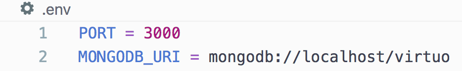
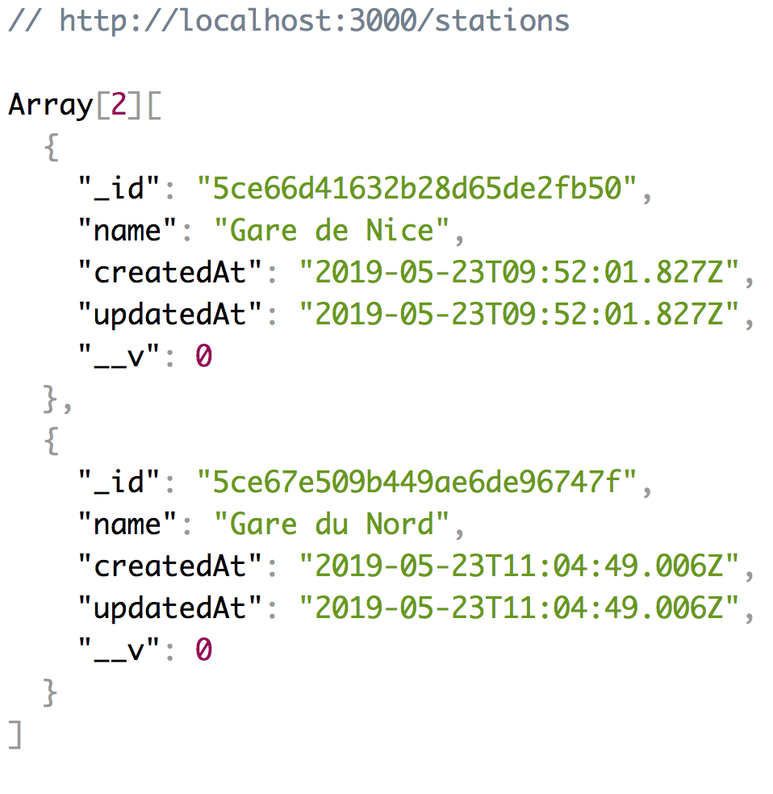

# Technical Challenge 🚗🚗

A short exercise put together as part of a technical test.

## How to run 
In order to run this project, clone it from github and do a `npm install` to download all the packages. 
Create a `.env` file to add the 'PORT' (if you want to change the default port number which is set to 3000) and 'MONGODB_URI' with the uri of the database you want to connect to eg 'MONGODB_URI = mongodb://localhost/virtuo'

You can run this by `nodemon app.js`

## Uses 
You can use the routes to create, read, update and delete on both cars and stations. 
In order for you to create a car, there must first be a station (because you need to reference the station id when you create the car)
A station can have many cars, but a car can only have one station. 

` /cars `  - to add a new car or view all current cars

`/cars/:id ` - to update or delete existing cars

`/stations`- to add a new station or view all current stations

`/stations/:id`- to update or delete existing stations

After creating some stations, you should be able to see them like this

## Testing 
To test, run `mocha` in your terminal 